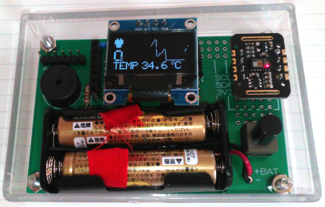
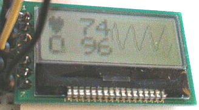
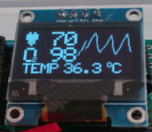
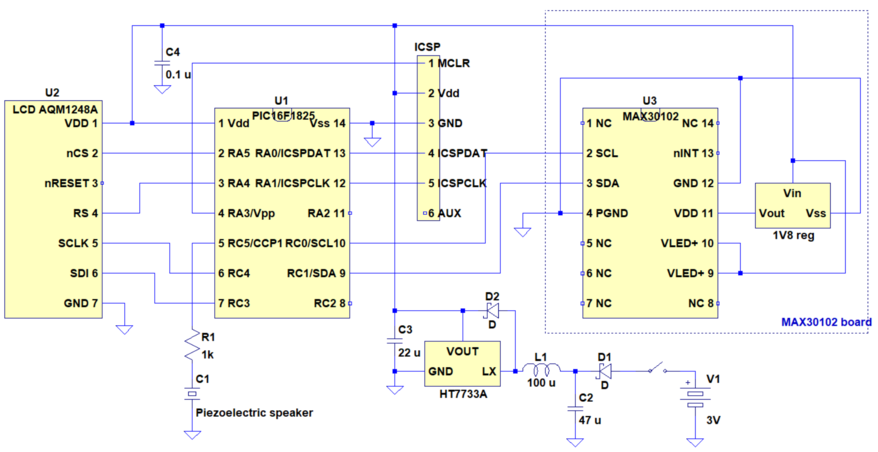
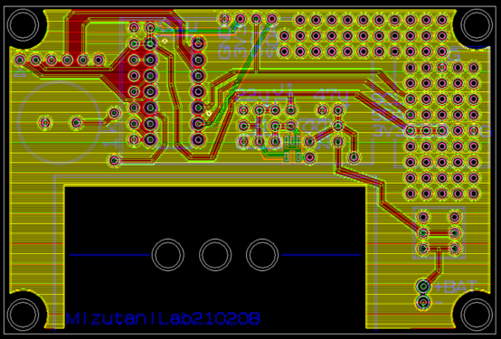
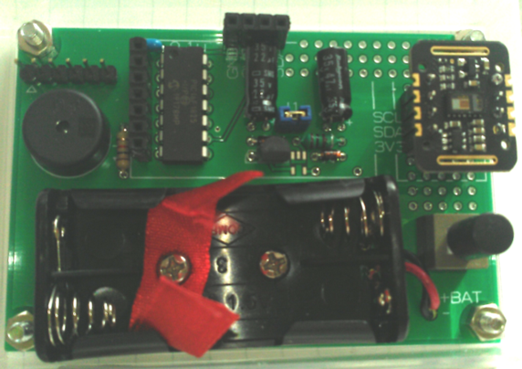
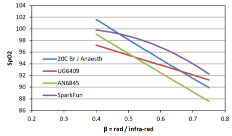

# Pulse-oximeter using MAX30102, AAA battery-powered   パルスオキシメーター MAX30102 使用，単４電池駆動
Of course, it's home brewed. もちろん自作です。 

  
## Display 表示
 
 
Obviously, I'm alive. 明らかに生きてます。  

## Schematic 回路図
Nothing special. 普通です。 

  

## PCB 基板
Gerber files are <A href="gerber/">here</a>. ガーバーファイルは<a href="gerber/">ここ</a>です。 

  

## BOM 部品表
<table>
<tr><th>Item</th><th>Description</th><th>Brand</th><th>QTY</th></tr>
<tr><td>Sensor</td><td>MAX30102 breakout</td><td>Maxim Integrated, etc</td><td>1</td></tr>
<tr><td>MCU</td><td>PIC16F1825-I/P</td><td>Microchip</td><td>1</td></tr>
<tr><td>Display</td><td>OLED with SSD1306 or AQM1248A</td><td>Sunhokey, etc Akizuki</td><td>1</td></tr>
<tr><td>3V3 boost conv</td><td>HT7733A (TO-92) or TPS613221ADBV, etc</td><td>Holtek TI</td><td>1</td></tr>
<tr><td>Schottkey D</td><td>SD103A</td><td>PANJIT or Vishay</td><td>2</td></tr>
<tr><td>Piezo speaker</td><td>PKM13EPYH4000-A0</td><td>muRata</td><td>1</td></tr>
<tr><td>L</td><td>100 uH</td><td>-</td><td>1</td></tr>
<tr><td>C</td><td>47 uF electrolytic</td><td>-</td><td>1</td></tr>
<tr><td>C</td><td>22 uF electrolytic</td><td>-</td><td>1</td></tr>
<tr><td>C</td><td>0.1 uF ceramic</td><td>-</td><td>1</td></tr>
<tr><td>R</td><td>1k ohm</td><td>-</td><td>1</td></tr>
<tr><td>SW</td><td>3p toggle or alternate push</td><td>-</td><td>1</td></tr>
<tr><td>Battery box</td><td>AAA x 2</td><td>-</td><td>1</td></tr>
<tr><td>Pin header</td><td>6 pin (ICSP)</td><td>-</td><td>1</td></tr>
<tr><td>Pin header & jumper</td><td>2 pin</td><td>-</td><td>1 each</td></tr>
<tr><td>Pin socket</td><td>7 pin (LCD) or 4 pin (OLED)</td><td>-</td><td>1</td></tr>
<tr><td>Pin socket</td><td>4 pin (MAX30102 board)</td><td>-</td><td>1-2</td></tr>
<tr><td>PCB</td><td>custom</td><td>-</td><td>1</td></tr>
<tr><td>Nuts & bolts</td><td>M3 x 10 mm</td><td>-</td><td>4 sets</td></tr>
<tr><td>Nuts & bolts</td><td>M2.6 x 6 mm</td><td>-</td><td>1-2 sets</td></tr>
<tr><td>Spacer</td><td>3 mm x 3 mm height, resin</td><td>-</td><td>4</td></tr>
<tr><td>Enclosure</td><td>85.5 x 59 x 24 mm, ABS</td><td>Akizuki</td><td>1</td></tr>
</table>
It's less than 25 US$ in total. MAX30102 breakout board with a 1.8V regulator is available from Maxim (MAXREFDES117#) and also from 3rd parties. MAX30101 board can also be used. There are two display options: OLED with SSD1306 and LCD AQM1248A with ST7565R. Choose one of them using #define directive. HEX binary for each display is available. HT7733A is a DC/DC boost converter, which can be substituted with TPS613221ADBV, TPS61097A-33DBV, MAX1724EZK33, or XC9142B33CMR-G. Surface mount pads for these devices are prepared, but not tested. If you use a substitute converter, L/C arrangements and their constants should also be reexamined accroding to datasheet recommendations. You may need tools, such as PIC programmer.  
全部で2500円いきません。MAX30102ボードはMaximのMAXREFDES117#などいくつかの種類が入手可能です。MAX30101のでも使えます。ディスプレイは、秋月グラフィックLCDか、SSD1306のOLEDを選べます。ソースコードの#define文で設定してください。HEXファイルはどちらも用意しています。おもて面のパッドはTPS613221ADBVなどHT7733Aの代替品用で、SOTパッケージのHT7733Aには使えません。センサはアマゾンで、それ以外は秋月で手に入ります。別途PICプログラマーなどのツールも必要です。
 

## SpO2 calculation 計算式
Four options are implemented. Default is option 1. 
4つあります。既定では1です。 
  1. SpO2 = -33.437 <i>R</i> + 114.9 (linear approximation of Reynolds et al. (1991) Br J Anaesth 67, 638) 
  2. SpO2 = -17 <i>R</i> + 104 (User guides & manuals 6409, Maxim Integrated) 
  3. SpO2 = 1.5958422 <i>R</i>2 -34.6596622 <i>R</i> + 112.6898759 (Application note 6845, Maxim Integrated) 
  4. SpO2 = -45.060 <i>R</i>2 + 30.354 <i>R</i> + 94.845 (MAX3010x sensor library, SparkFun) 
where <i>R</i> = (ACred / DCred) / (ACIR / DCIR).  
 <a href="spo2models.xlsx">Excel file</A> 

## References 参考
Reynolds et al. (1991) Br J Anaesth 67, 638-643. <a href="https://doi.org/10.1093/bja/67.5.638">DOI</A> 
Recommended Configurations and Operating Profiles for MAX30101/MAX30102 EV Kits, <a href="https://www.maximintegrated.com/en/design/technical-documents/userguides-and-manuals/6/6409.html">User guides & manuals 6409</a>, Maxim Integrated 
Guidelines for SpO2 Measurement Using the MaximR MAX32664 Sensor Hub, <a href="https://www.maximintegrated.com/en/design/technical-documents/app-notes/6/6845.html">Application note 6845</a>, Maxim Integrated 
MAX3010x sensor library, SparkFun. <a href="https://github.com/sparkfun/SparkFun_MAX3010x_Sensor_Library">GitHub</a> 

## DISCLAIMER お断り
This repository is provided "AS IS", without warranty of any kind, either express or implied. Use it on your own responsibility. 
このリポジトリは「そのまま」で提供されており、明示・暗示を問わず、いかなる保証もありません。ご利用はご自身のご責任でどうぞ。
