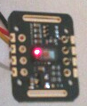

# Pulse-oximeter using MAX30102  パルスオキシメーター MAX30102 使用

## LCD 表示
 
   

## Schematic 回路図

 

## PCB 基板
Gerber files are in preparation. ガーバーファイルは準備中です。 

 

## BOM 部品表
Under construction. 準備中
   

## SpO2 calculation 計算式
Four options are implemented. Default is option 3. 
4つあります。既定では3です。 
  1. SpO2 = -33.437 <i>R</i> + 114.9 (linear approximation of Reynolds et al. (1991) Br J Anaesth 67, 638) 
  2. SpO2 = -17 <i>R</i> + 104 (User guides & manuals 6409, Maxim Integrated) 
  3. SpO2 = 1.5958422 <i>R</i>2 -34.6596622 <i>R</i> + 112.6898759 (Application note 6845, Maxim Integrated) 
  4. SpO2 = -45.060 <i>R</i>2 + 30.354 <i>R</i> + 94.845 (MAX3010x sensor library, SparkFun) 
where <i>R</i> = (ACred / DCred) / (ACir / DCir). 

 

## References 参考
Reynolds et al. (1991) Br J Anaesth 67, 638-643. <a href="https://doi.org/10.1093/bja/67.5.638">DOI</A> 
Recommended Configurations and Operating Profiles for MAX30101/MAX30102 EV Kits, <a href="https://www.maximintegrated.com/en/design/technical-documents/userguides-and-manuals/6/6409.html">User guides & manuals 6409</a>, Maxim Integrated 
Guidelines for SpO2 Measurement Using the MaximR MAX32664 Sensor Hub, <a href="https://www.maximintegrated.com/en/design/technical-documents/app-notes/6/6845.html">Application note 6845</a>, Maxim Integrated 
MAX3010x sensor library, SparkFun. <a href="https://github.com/sparkfun/SparkFun_MAX3010x_Sensor_Library">GitHub</a> 

## DISCLAIMER お断り
This repository is provided "AS IS", without warranty of any kind, either express or implied. このリポジトリはこのままの形で提供されており、明示・暗示を問わず、いかなる保証も致しません。
