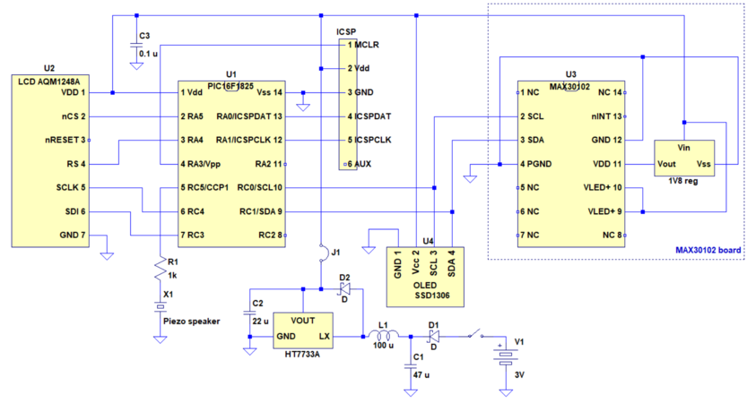
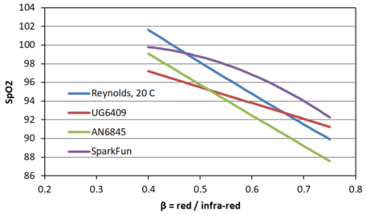

# A pulse-oximeter using MAX30102  パルスオキシメーター　MAX30102使用

## LCD
 

## Schematic

## PCB

## BOM
under construction

## SpO2 calculation
Four options are implemented. Our recommendation is option 1. 
4つあります。1がお勧めです。 
  1. SpO2 = 1.5958422 <i>R</i>2 -34.6596622 <i>R</i> + 112.6898759 (Application note 6845, Maxim Integrated) 
  2. SpO2 = -33.437 <i>R</i> + 114.9 (linear approximation of Reynolds et al. (1991) Br J Anaesth 67, 638) 
  3. SpO2 = -17 <i>R</i> + 104 (UG6409, Maxim Integrated) 
  4. SpO2 = -45.060 <i>R</i>2 + 30.354 <i>R</i> + 94.845 (MAX3010x sensor library, SparkFun) 
where <i>R</i> = (ACred / DCred) / (ACir / DCir). 

## References
Reynolds et al. (1991) Br J Anaesth 67, 638-643 
Guidelines for SpO2 Measurement Using the MaximR MAX32664 Sensor Hub, Application note 6845, Maxim Integrated 
Recommended Configurations and Operating Profiles for MAX30101/MAX30102 EV Kits, UG6409, Maxim Integrated 
MAX3010x sensor library, SparkFun 
